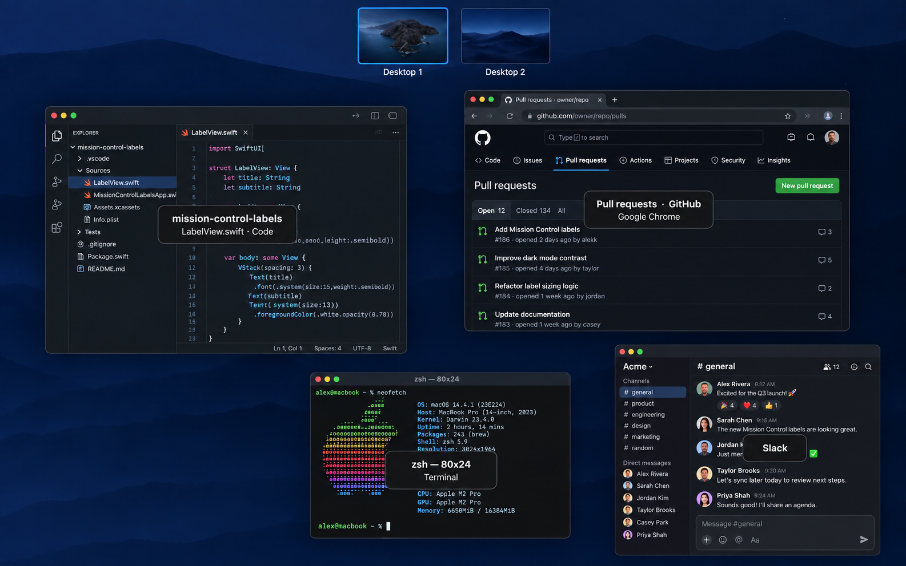
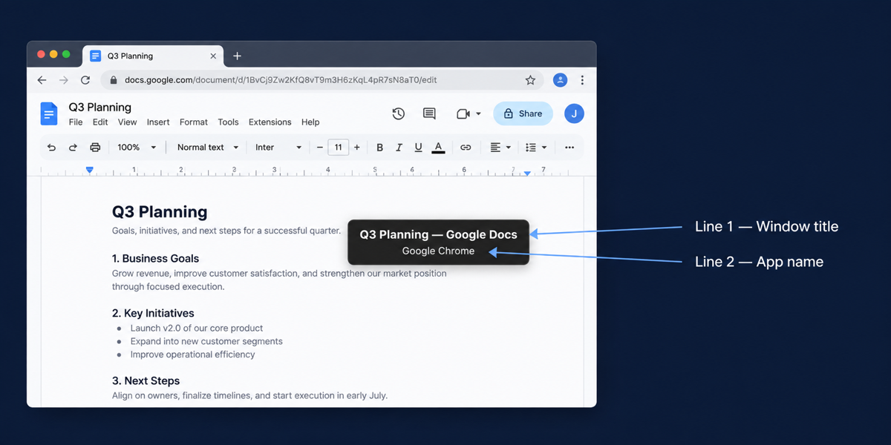

<div align="center">

# Mission Control Labels

A menu bar app that **always shows the window title and app name** on every window in macOS Mission Control.

**English** · [한국어](README.KR.md)



</div>

## Overview

Mission Control lays out every window at a glance, but you have to hover to find out which one is which. Mission Control Labels shows the **window title and app name on every window** while Mission Control is open. Selecting, dragging, pressing Esc, and moving between Spaces work exactly as before.

- Uses only the Accessibility permission. No Screen Recording, no SIP changes, no private APIs.
- Labels pass clicks through, so they never get in the way of Mission Control.
- Window titles are never logged or sent anywhere.

## Features



- **Title first** — Line 1 is the window title, line 2 is the app name. Windows without a title show the app name only.
- **Choose the position** — Center, top left, top right, bottom left, or bottom right, from the menu.
- **Choose the order** — Title / app name by default, or app name / title, from the menu.
- **VS Code workspace first** — For VS Code, Cursor, Windsurf and friends, line 1 shows the workspace name and line 2 shows `file · Code`.
- **Multiple displays** — Works on every connected screen.

## Requirements

- macOS 14 or later (tested on macOS 26, Apple Silicon)
- Xcode 16 or later to build
- Accessibility permission

## Installation

Build from source for now.

```sh
git clone https://github.com/hmu332233/mission-control-labels.git
cd mission-control-labels
scripts/build-app.sh release
open build/MissionControlLabels.app
```

1. On first launch you will be asked for permission. Allow `MissionControlLabels` under **System Settings → Privacy & Security → Accessibility**.
2. Open Mission Control (F3 or Control–↑). Each window gets a label.
3. Use the rectangle icon in the menu bar to toggle labels, change the label position or info order, or quit.

To launch at login, move the app to `/Applications` and add it under **System Settings → General → Login Items**.

> [!NOTE]
> The build script signs with the Apple Development certificate found in your keychain. Without one it falls back to ad-hoc signing, in which case you need to grant the Accessibility permission again after every rebuild.

## Troubleshooting

- **No labels appear** — Check the permission status in the menu. After a rebuild, remove the app from the Accessibility list and add it again.
- **Some windows show only the app name** — That app does not expose a window title. This is expected.

## License

[MIT](LICENSE)
